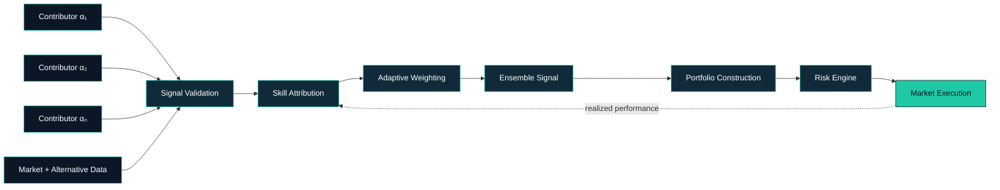
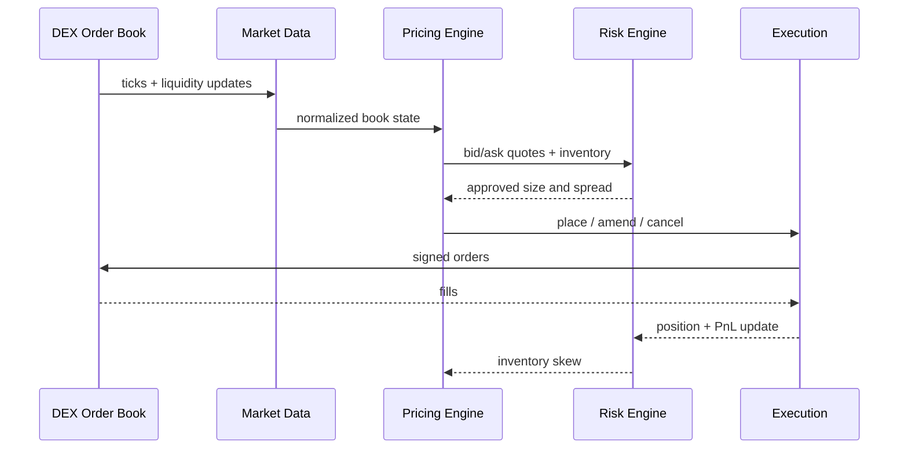

<div align="center">

# Raif Salauddin Mondal

### Founder & CEO · Quantitative Finance · Market Infrastructure

`COLLECTIVE INTELLIGENCE` · `HFT` · `MARKET MICROSTRUCTURE` · `SYSTEMATIC RESEARCH`

<br>

[](https://indiquantresearch.in/)
[](https://playmaker-by-cawm.github.io/frontend/)
[](https://linkedin.com/in/raifmondal)

[](https://x.com/AdorableTrooper)
[](https://medium.com/@ad0rable)
[](https://github.com/myselfRaifMondal)

</div>

```text
┌────────────────────────────── QUANT DESK ──────────────────────────────┐
│  RESEARCH       SIGNALS       PORTFOLIO       EXECUTION       RISK     │
│     ●──────────────●──────────────●──────────────●──────────────●      │
│  distributed    adaptive       systematic     low-latency    real-time │
│  intelligence   ensemble       allocation     market making  controls  │
└─────────────────────────────────────────────────────────────────────────┘
```

## ◈ Investment Thesis

> The next generation of market edge will not come from isolated models alone. It will come from systems that aggregate distributed insight, measure predictive skill, adapt capital allocation, and execute with discipline.

My work is focused on two parts of that thesis:

- 🧠 **Crowdsourced intelligence** — turning independent market views into measurable, continuously weighted signals.
- ⚡ **High-frequency market infrastructure** — building low-latency systems for liquidity provision, execution, and risk control.

---

## ◈ Building

<table>
<tr>
<td width="50%" valign="top">

<h3 align="center">INDIQUANT</h3>
<p align="center"><strong>Collective Intelligence for Indian Markets</strong></p>
<p align="center">
  <a href="https://indiquantresearch.in/">
    
  </a>
</p>

**Founder & CEO**

A quantitative investment and collective-intelligence venture focused on Indian markets.

`₹50 Cr AUM` · `Signal Aggregation` · `Attribution`

Crowdsourced research, anonymous contribution architecture, adaptive ensembling, and performance-weighted intelligence designed around Indian market microstructure.

<p align="right"><a href="https://indiquantresearch.in/"><strong>VISIT INDIQUANT →</strong></a></p>

</td>
<td width="50%" valign="top">

<h3 align="center">PLAYMAKER</h3>
<p align="center"><strong>High-Frequency Liquidity Infrastructure</strong></p>
<p align="center">
  <a href="https://playmaker-by-cawm.github.io/frontend/">
    
  </a>
</p>

**Founder & CEO**

A high-frequency market-making venture for decentralized crypto exchanges.

`DEX` · `Market Making` · `Low Latency`

Automated liquidity provision, inventory-aware pricing, real-time risk controls, and low-latency market-data and execution systems.

<p align="right"><a href="https://playmaker-by-cawm.github.io/frontend/"><strong>EXPLORE PLAYMAKER →</strong></a></p>

</td>
</tr>
</table>

---

## ◈ Quant Systems

### IndiQuant · Collective Alpha Engine



The ensemble is designed around a simple principle:

$$
\hat{\alpha}_{t} = \sum_{i=1}^{N} w_{i,t}\,\alpha_{i,t},
\qquad
w_{i,t} \propto f(\text{predictive skill}_{i,\,1:t})
$$

### PlayMaker · HFT Market-Making Loop



$$
\text{quote spread}
=
\text{base spread}
+ \lambda_{\sigma}\sigma_t
+ \lambda_{I}\lvert I_t\rvert
+ \lambda_{L}L_t
$$

---

## ◈ Quantitative Focus

<div align="center">


</div>

---

## ◈ Selected Research & Engineering

| Project | Research Area | Stack |
|:--|:--|:--|
| **[Trade-Base](https://github.com/myselfRaifMondal/Trade-Base)** | Systematic research, backtesting, risk | `Python` `Quant` |
| **[Fundamental Data Scraper](https://github.com/myselfRaifMondal/Fundamental-Financial-Data-Scrapper)** | Automated fundamental data acquisition | `Python` `ETL` |
| **[FinNews Sentiment](https://github.com/myselfRaifMondal/FinNews-Sentiment-Analysis)** | Financial NLP and signal research | `NLP` `ML` |
| **[Derivative Pricing](https://github.com/myselfRaifMondal/Derivative-Pricing)** | Quantitative pricing models | `Python` `Models` |
| **[JPMorgan Quant Projects](https://github.com/myselfRaifMondal/JP-Morgan-Quant-Projects)** | Pricing, risk, quantitative research | `Risk` `Analytics` |

---

## ◈ Background

My path into quantitative finance began with a quantitative-trading internship during the final year of college. I am now building IndiQuant and PlayMaker around a common objective: converting better intelligence and better infrastructure into durable market edge.

I work across strategy, research, product, and engineering—from forming the market thesis to designing the systems that test and execute it.

---

## ◈ Technology

<div align="center">


</div>

---

## ◈ Engineering Activity

<div align="center">


<br>


</div>

---

<div align="center">

### `BUILD INTELLIGENCE · ENGINEER EXECUTION · COMPOUND EDGE`

Open to conversations with investors, researchers, engineers, founders, and market practitioners.

[](https://linkedin.com/in/raifmondal)
[](https://x.com/AdorableTrooper)
[](https://medium.com/@ad0rable)

</div>
