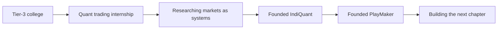
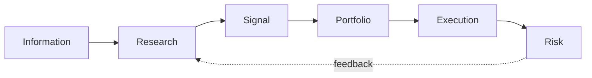

# Raif Salauddin Mondal

### Founder & CEO at [IndiQuant](https://indiquantresearch.in/) and [PlayMaker](https://playmaker-by-cawm.github.io/frontend/)

Building at the intersection of quantitative finance, collective intelligence, 
market microstructure, and high-performance systems.

[LinkedIn](https://linkedin.com/in/raifmondal) ·
[X](https://x.com/AdorableTrooper) ·
[Medium](https://medium.com/@ad0rable) ·
[GitHub](https://github.com/myselfRaifMondal)

---

## The story so far

I did not begin with the conventional path into quantitative finance.

I came from a tier-3 college, without the usual institutional access or industry network. During my final year, I earned an internship at a quantitative trading firm. That experience changed the direction of my work: markets stopped looking like charts and started looking like systems—driven by information, incentives, probability, and execution.

What began as an attempt to understand those systems became a decision to build them.

Today, I lead two ventures shaped by the same conviction: lasting edge comes from combining better intelligence with better infrastructure.

---

## What I am building

<table>
<tr>
<td width="50%" valign="top">

### [IndiQuant](https://indiquantresearch.in/)

**Founder & CEO · Private Beta**

IndiQuant is a quantitative research venture exploring how collective intelligence can create a stronger way to understand Indian markets.

The work sits at the intersection of:

- Quantitative research
- Crowdsourced intelligence
- Indian market structure
- Research infrastructure

[Visit IndiQuant →](https://indiquantresearch.in/)

</td>
<td width="50%" valign="top">

### [PlayMaker](https://playmaker-by-cawm.github.io/frontend/)

**Founder & CEO · MVP**

PlayMaker is a quantitative engineering venture focused on high-performance market infrastructure for digital assets.

The work sits at the intersection of:

- High-frequency systems
- Market microstructure
- Digital-asset markets
- Systems engineering

[Explore PlayMaker →](https://playmaker-by-cawm.github.io/frontend/)

</td>
</tr>
</table>

The public descriptions are intentionally high-level. The underlying models, architecture, strategies, and operating details remain private.

---

## How I think about markets

Markets are not a single problem. They are a chain of connected problems:

My interests span that chain, but two questions keep pulling me back:

1. **How can distributed human intelligence become measurable?**

   Good ideas are scattered across people, disciplines, and perspectives. I am interested in systems that can recognize useful insight without flattening what makes it valuable.

2. **How much edge is lost between an idea and its execution?**

   A model can be right and still fail in the market. Latency, liquidity, market impact, inventory, and risk determine whether theoretical edge survives contact with reality.

That is where my work on collective intelligence and high-frequency infrastructure meets.

---

## From questions to code

My repositories document the path I took while learning to turn financial questions into working systems.

| Project | The question behind it |
|:--|:--|
| **[Trade-Base](https://github.com/myselfRaifMondal/Trade-Base)** | How should systematic ideas be researched, tested, and evaluated? |
| **[Fundamental Financial Data Scrapper](https://github.com/myselfRaifMondal/Fundamental-Financial-Data-Scrapper)** | How can fragmented financial information become research-ready data? |
| **[FinNews Sentiment Analysis](https://github.com/myselfRaifMondal/FinNews-Sentiment-Analysis)** | Can unstructured financial news be transformed into a measurable signal? |
| **[Derivative Pricing](https://github.com/myselfRaifMondal/Derivative-Pricing)** | How do mathematical assumptions become prices and risk estimates? |
| **[JPMorgan Quant Projects](https://github.com/myselfRaifMondal/JP-Morgan-Quant-Projects)** | How are pricing, probability, and risk used in practical quant research? |

These are not isolated portfolio pieces. Together, they trace a progression from collecting data, to modeling markets, to testing strategies, to thinking about execution.

---

## The toolkit

I choose technology based on the problem: Python for research, C++ when performance matters, SQL for structured evidence, and production infrastructure when an idea must operate beyond a notebook.

| Research and modeling | Data and systems | Infrastructure |
|:--|:--|:--|
| Python | PostgreSQL | Linux |
| PyTorch | Redis | Docker |
| scikit-learn | Kafka | AWS |
| Quantitative methods | SQL | C++ |

---

## Still compounding

I am still early in the journey.

There is more to learn about market behavior, more infrastructure to build, and more assumptions to challenge. I use GitHub as a record of that process—the experiments that worked, the ones that did not, and the systems that emerged from both.

---

### Better questions. Better systems. Better decisions.

I am always interested in thoughtful conversations with investors, researchers, 
engineers, founders, and people who see markets differently.

[LinkedIn](https://linkedin.com/in/raifmondal) ·
[X](https://x.com/AdorableTrooper) ·
[Medium](https://medium.com/@ad0rable) ·
[IndiQuant](https://indiquantresearch.in/)

